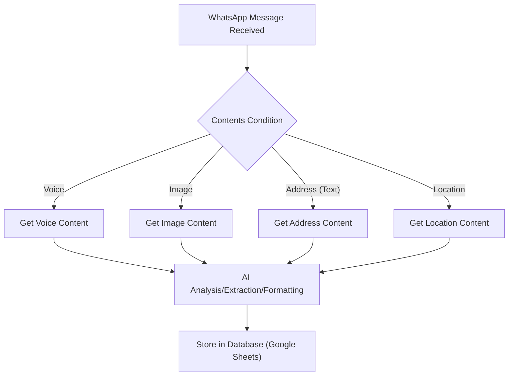
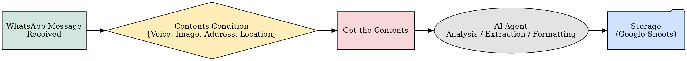
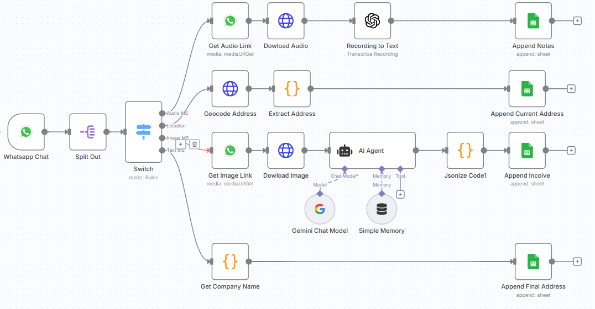
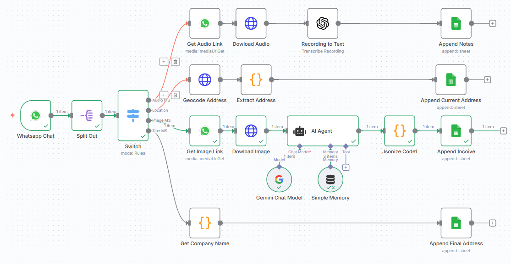
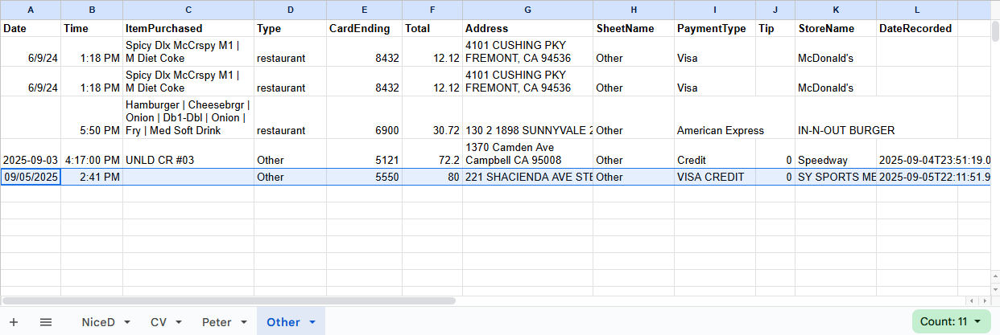

# N8n Invoice Processing Workflow

## Overview

This project demonstrates an automated WhatsApp Business message processing workflow using [n8n](https://n8n.io/). It integrates WhatsApp, GenAI models, and Google Sheets to streamline invoice management and data extraction.

## Features

- Automated business expense(invoice, mileage) collection, from WhatsApp message
- Extract and validation data
- Integration with AI models on your preference(OpenAI, Gemini, and so on)
- Storage and tracking in Google Sheets
- Error handling and notifications

## Project Structure

```
workflows/         # n8n workflow JSON exports
assets/            # Images, diagrams, or demo screenshots
docs/              # Documentation and architecture
scripts/           # Helper scripts (e.g., setup)
```

## Getting Started

1. **Clone the repository:**
   ```powershell
   git clone https://github.com/yunjianlu/whatAppMSToSheet.git
   cd whatAppMSToSheet
   ```
2. **Import the workflow:**
   - Open n8n.
   - Import the JSON file from `workflows/invoice-processing.json`.
3. **Configure credentials:**
   - Set up WhatsApp, Model's API, and Google Sheets credentials in n8n.
4. **Run the workflow:**
   - Trigger the workflow and monitor execution.

## Architecture

The workflow processes WhatsApp messages of various types (voice, image, address, location), uses AI for extraction/formatting, and stores results in Google Sheets.



For a detailed breakdown, see [docs/architecture.md](docs/architecture.md).

---

## Demo & Visuals

---

<p align="center">
   
   <br/><em>Simplified WhatsApp Architecture</em>
</p>

---

<p align="center">
   
   <br/><em>Complete n8n Workflow</em>
</p>

---

<p align="center">
   
   <br/><em>Invoice Processed Example</em>
</p>

---

<p align="center">
   
   <br/><em>Google Sheet Output</em>
</p>

## License

This project is licensed under the MIT License. See [LICENSE](LICENSE) for details.

## Contact

For questions or collaboration, please open an issue or contact me on [LinkedIn](https://www.linkedin.com/in/yunjian-lu/).
